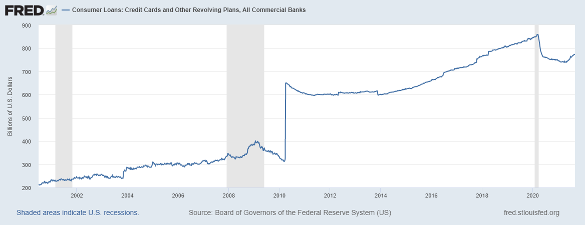

# Case Study Proposal

  

## Self: Paving the way to a healthier credit score
Founded: March 3, 2015

Founders: 
> James Garvey [linkedin](https://linkedin.com/in/jkgarvey)      
Conor Swanson [linkedin](https://www.linkedin.com/in/conorswanson)

>> “CEO James Garvey co-founded Self in 2015 after a time where he thought he set up his credit cards for automatic payments, yet hadn’t. When he realized his mistake a few months later his credit score had already fallen from 750 to 594. The experience gave him a deeper appreciation of the challenges millions of Americans face in building and maintaining credit, and so he decided to use his background as a technologist and entrepreneur to develop a better solution to help people overcome those obstacles.” 

### Funding
In total Self Financial, Inc. has raised $77 million in capital from 16 investors over 9 funding rounds.  The most significant funding rounds are listed below:

* May 23, 2015 - Initial Seed Funding raised $535,000 consisting of 7 initial investors
* July 21, 2015 - Initial Seed Funding raised $1.5 million from two Venture Capital Firms
* July 17, 2017 - Seed A Funding raised $5 million from a Venture Captial Firm
* November 15, 2018 - Seed B Funding raised $10 million from four Venture Capital Firms
* February 19, 2019 - Seed C Funding raised $20 million from four Venture Capaital Firms
* December 15, 2020 - Seed D Funding raised $40 million from five Venture Capital Firms

### Business Activities
Self Lender's mission is to help people build credit, particularly those who are new to credit or who might not have access to traditional financial products.   Self’s Credit Builder Account offers an installment loan that enables those who make payments on time to build a positive payment history and improve their credit while simultaneously saving money.  The customer doesn’t have access to the funds upfront, instead the loan proceeds are held in a certificate of deposit with a partnering bank.  Once the loan is paid in full the customer receives the funds.  Throughout the repayment period, the customer has access to a free credit monitoring system and a VantageScore is provided by Experian so the individual can track their credit score progress.  Self is one of many fintechs helping consumers become financially healthy. 

The intended customer are individuals without access to traditional financial products or those who are new to credit including immigrants, young people, low-income consumers and women.  With rising living costs and stagnant wage increases nearly half of Americans are living pay check to paycheck and have less than $15,000 in savings.  When it comes to demographics, the largest group living paycheck-to-paycheck is millennials 77%, especially bridge millennials (those 33 to 42 years old) -- with 33% struggling to pay their bills. More than 40% of people in the United States don’t have the funds necessary to “survive in the modern economy,” That’s almost 51 million households that don’t have enough money to pay for transportation, housing, food, childcare and health care.

Data from Web Service FRED reflects that since the great recession of 2008 to 2010 people living off credit cards or consumer lines of credit has increased significantly.  Prior to 2008 total outstanding balance of consumer loans and credit cards in the United States was roughly $335 billion.  But by April of 2010 there was a significant spike to $649 billion and since has steadily inclined over the last 10 year to total outstanding debt of $858 billion in March of 2020. 

**Increase in Credit Card Debt**

Community Banks and Credit Unions have long offered credit building loans but are limited to their local communities.  Additionally, people with poor or no credit typically are not approved for these traditional banking products.  Self Financial is available to applicants in all fifty states and unlike most personal loans, credit-builder loans are open to people who have no credit or even bad credit. This is because the lender doesn’t have much risk since they hold the savings account until you finish paying.  People trying to establish credit have other options like secured credit cards or personal loan.  However, with those products you need the cash up front.  People can build their credit with credit cards; however, the interest rates are higher than a credit builder loan and doesn’t also solve the problem of helping people increase their savings. 

In recent years, a number of larger banks and credit unions have developed credit builder products including Marcus by Goldman Sacs, Credit Karma, Credit Strong, Affinity Plus Credit Union.  When comparing these products Self has some of the least favorable terms.  Marcus allows for loans up to $40,000 with interest rates ranging from 6.99% to 19.99%.  Affinity Plus’ product offers a rate of 6%.  Both these are favorable to Self’s rate range of 12% to 15%.  However, the significant difference between Self’s credit builder plan and other online credit builder plans, again, is that Self’s program helps people save in addition to building credit.

### Technologies 

Self Financial uses Java for it's programing language and development platform.

### Landscape
Self Financial, Inc is in the Financial Services and Personal Finance industry.  These industries have seen a significant and continuous focus on digitalization and adoption of new and emerging technologies to bring in operational efficiencies and enhance customer experiences.  Artificial Intelligent, Big Data Analytics, Machine learning application to finance is transforming the financial management domain.  Specifically, below are four digital technologies that are re-shaping the finance management:

* Automation and robotics, which helps in improving processes
* Data Visualization, which gives end users real-time easy to understand financial informaiton
* Basic analytics, which can helps in efficient decision support
* Advanced analytics, which can help businesses to uncover hidden shareholder value and growth opportunities.

There are a wide range of companies within the Financial Service Sector ranging from the “Big Banks” like Bank of America, Wells Fargo, US Bank, Chase, and Goldman Sacks.  Competition lies also with National Banks, Community Banks and Credit Unions.  

### Results
Self Financial has helped more than 500,000 consumers by providing $400 million in CD-secured loans.  In 2020 Self has seen its active customer base rise 250%.  Self recently launched Self Visa@ Credit Card, a secured credit card that does not require a credit check and enables customers to build their CD's in installments rather than having to mak a large upfront depoist.  Through Self's credit builder program average credit score increase is 32 points. 

### Recommendations
1. The first recommendation I would have for the company would to assess their interest rate offers.  Other credit builder loans have rate offerings as low as 6%.  Self's risk has been reduced as the loan is cash secured.  However, that is offset by the potential interest earnings the customer receives in the certificate of deposit which reduces the margin on the loan.  Offering a lower rate will keep Self competitive with the market.  Self could utilize blockchain to help reduce their interest risk.   By removing the need for gatekeepers in the loan and credit industry, blockchain technology can make it more secure to borrow money and provide lower interest rates.
2. Self has started offering additional products including a secured credit card.  This gives the customer additional access to credit.  I would like to see additional savings products or investment/retirement opportunities.  Self, prides itself on helping consumers build credit while creating additional savings.  A significant amount of American’s are living pay check to pay check let alone have sufficient money saved for unexpected health care costs or retirement.  Self could add a health savings account or IRA product to their products.  This will expand their core mission of improving the overall financial health of Americans. Should they add a retirement product to their services they could utilize RoboAdvisors and Machine Learning to automate investment option with managed portfolios and portfolio rebalancing.

### Resources
Self Financial, Inc. https://www.self.inc/     
CrunchBase  https://www.crunchbase.com/organization/self-lender   
Nerd Wallet https://www.nerdwallet.com/article/finance/self-lender-credit-builder-loans     
Career Builder https://press.careerbuilder.com/2017-08-24-Living-Paycheck-to-Paycheck-is-a-Way-of-Life-for-Majority-of-U-S-Workers-According-to-New-CareerBuilder-Survey  
Global Newswire  https://www.globenewswire.com/en/news-release/2020/12/15/2145309/0/en/Self-Financial-Raises-40M-in-Series-D-Led-by-Meritech-Capital.html   
CNN Business https://money.cnn.com/2018/05/17/news/economy/us-middle-class-basics-study/index.html  
Wallet Hub https://wallethub.com/edu/pl/credit-builder-loan/67945   
FRED https://fred.stlouisfed.org/series/CCLACBW027SBOG   
The World Bank https://data.worldbank.org/  
Lending Club https://www.prnewswire.com/news-releases/nearly-40-percent-of-americans-with-annual-incomes-over-100-000-live-paycheck-to-paycheck-301312281.html

